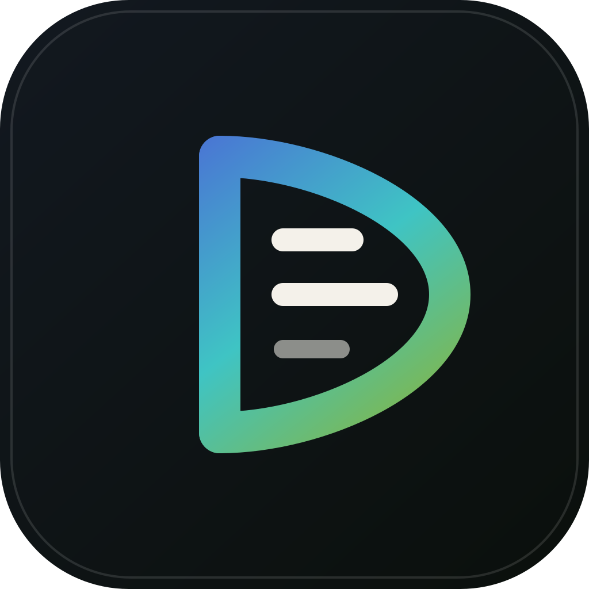

<p align="center">
  
</p>

# DMPResearch landing

Studio marketing site for [DMPResearch](https://github.com/DMPResearch).

- **Repo:** [DMPResearch/dmpresearch-landing](https://github.com/DMPResearch/dmpresearch-landing)
- **Public URL:** [https://dmpresearch.flowstarter.dev](https://dmpresearch.flowstarter.dev)
- **Stack:** Astro 7 static site, Node 22+, Netlify publish of `dist`
- **Mark:** `public/mark.svg` (also used as favicon source via `public/favicon.svg`)

Philosophy on the site: automate the mundane, amplify the human. We build premium websites, web apps, and product systems. AI speeds the grind. People keep judgment.

## Product surfaces

| Surface | What it is |
|---|---|
| **Flowstarter** | Mostly self-serve website factory for service businesses; we step in for polish and ambiguous copy |
| **Ereno** | Trip / base planner that shows sources; no booking layer |
| **Client work** | Sites shipped for other people |
| **Studio** | Careers / contracting, investors, about, FAQ, contact |

## Local development

```sh
npm install
npm run dev
```

```sh
npm run build
npm run preview
```

Requires Node `>=22.12.0`.

## Project layout

```
src/
  components/     # Header, Hero, Product, Method, Team, Contact, cookies, …
  content/
    site.ts       # English product copy (primary source of truth today)
    legal.ts      # Privacy, cookies, terms, consent copy
  i18n/           # Locale registry + chrome strings (English live)
  layouts/        # Root layout, theme boot, reveal observers
  pages/          # /, /about, /investors, /careers, legal pages
  styles/         # Design tokens, atmosphere, global UI
public/           # Fonts, mark, product screenshots
scripts/          # Local tunnel host router (ops)
logs/             # Ops notes (runtime *.log ignored by git)
.github/workflows # CI / CD
```

Home page order: Hero → Products → Work → Philosophy (Vision) → About teaser → Method → Team → Investors / Careers teasers → FAQ → Contact → Footer.

Copy and labels live in `src/content/site.ts` and `src/content/legal.ts`. Do not hardcode user-visible strings in components when a dictionary already owns them.

## Design and motion

- Canvas cream `#f3f2ed`, ink `#12161c`, accent gradient blue → teal → olive from the brand mark
- Fonts: Bricolage Grotesque (display), Geist (body), Geist Mono (labels)
- Fixed frosted header with scroll progress bar
- Sticky Method loop that advances steps as panels pass
- `data-reveal` blur-in, parallax ribbons, spotlight cards (respects `prefers-reduced-motion`)
- Cookie consent is a small frosted bar, not a full-screen wall

Front-end rules:

- Nothing may require hover to become readable
- Mailto links stay same-tab
- Sections should still make sense with JavaScript off; motion and Calendly enhance, they do not own the message

## Internationalization

English is the only live locale. Astro `i18n` is configured with `prefixDefaultLocale: false`.

- Config: `src/i18n/config.ts`
- Switcher: footer `LanguageSwitch` (English active; Română / Deutsch listed as coming soon)
- How to add a locale: `src/i18n/README.md`

## CI / CD

Workflow: `.github/workflows/ci-cd.yml`

| Job | When | What |
|---|---|---|
| **Build** | every push / PR | `npm ci` + `npm run build`, uploads `dist` |
| **Deploy to Netlify** | when `NETLIFY_SITE_ID` is set | production on `main`, draft preview on PRs |

Secrets / variables on the GitHub repo:

| Name | Type | Purpose |
|---|---|---|
| `NETLIFY_AUTH_TOKEN` | Secret | Netlify personal access token |
| `NETLIFY_SITE_ID` | Variable | `f7e7d93e-2f98-48f1-b756-d9fe0721cb54` |

```sh
gh variable set NETLIFY_SITE_ID \
  --repo DMPResearch/dmpresearch-landing \
  --body f7e7d93e-2f98-48f1-b756-d9fe0721cb54

gh secret set NETLIFY_AUTH_TOKEN --repo DMPResearch/dmpresearch-landing
```

More detail: `.github/README.md`.

`netlify.toml` builds with Node 22 and publishes `dist`. Security headers: `X-Frame-Options`, `X-Content-Type-Options`, `Referrer-Policy`.

Manual deploy when needed:

```sh
npm run build
netlify deploy --prod --dir=dist
```

## Ops log: temporary local tunnel

During 2026-09-10, Netlify production deploys were blocked (`Account credit usage exceeded`). The public hostname stayed up through a local static serve + host router + existing Cloudflare tunnel.

Recorded in `logs/LOCAL_TUNNEL.md`:

| Piece | Detail |
|---|---|
| Static site | LaunchAgent `com.dmpresearch.local-site` → `npx serve dist` on `127.0.0.1:18191` |
| Host router | LaunchAgent `com.dmpresearch.host-router` → `scripts/tunnel-host-router.mjs` on `[::]:5733` |
| Routing | `Host: dmpresearch.flowstarter.dev` → `127.0.0.1:18191` |
| Public edge | Existing Cloudflare tunnel `flowstarter-dev` (wildcard `*.flowstarter.dev` → `localhost:5733`) |
| Why IPv6 | cloudflared dials `[::1]:5733`, so the router must listen on `::` |

After local edits while the tunnel is active:

```sh
cd /path/to/dmpresearch-landing && npm run build
# serve picks up new dist; restart serve only if the LaunchAgent died
```

When Netlify credit is healthy again and Actions/Netlify own production:

```sh
netlify deploy --prod --dir=dist
launchctl bootout gui/$(id -u)/com.dmpresearch.local-site
launchctl bootout gui/$(id -u)/com.dmpresearch.host-router
```

Runtime log files under `logs/*.log` are gitignored. Keep `logs/LOCAL_TUNNEL.md` as the human-readable ops note.

## Useful commands

```sh
# Dev
npm run dev

# Production build
npm run build

# Local CI parity
npm ci && npm run build

# Watch Actions
gh run list --repo DMPResearch/dmpresearch-landing --workflow "CI / CD" --limit 5
```

## Agent notes

`AGENTS.md` (and `CLAUDE.md` symlink) hold conventions for coding agents working in this repo.
